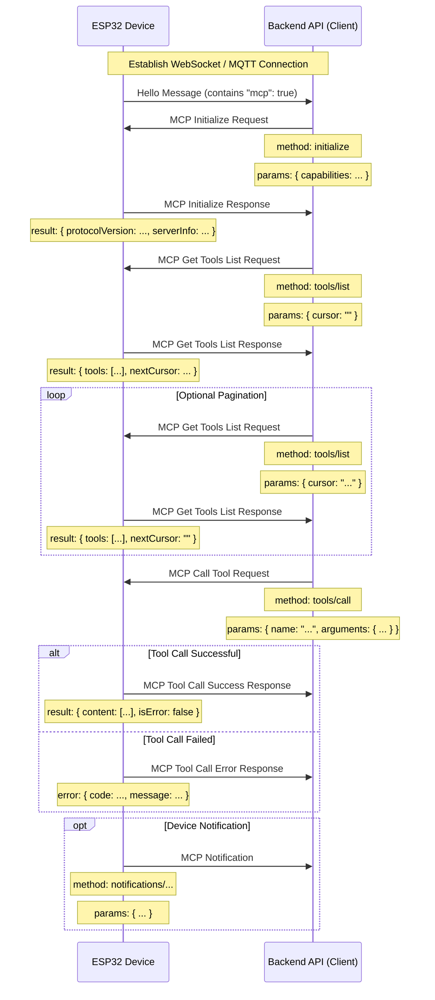

# MCP (Model Context Protocol) Interaction Flow

NOTICE: AI-assisted generation. Please refer to the code for details when implementing backend services!!

The MCP protocol in this project is used for communication between backend API (MCP client) and ESP32 device (MCP server), enabling the backend to discover and invoke functions (tools) provided by the device.

## Protocol Format

According to the code (`main/protocols/protocol.cc`, `main/mcp_server.cc`), MCP messages are encapsulated in the message body of basic communication protocols (such as WebSocket or MQTT). The internal structure follows the [JSON-RPC 2.0](https://www.jsonrpc.org/specification) specification.

Overall message structure example:

```json
{
  "session_id": "...", // 会话 ID
  "type": "mcp",       // 消息类型，固定为 "mcp"
  "payload": {         // JSON-RPC 2.0 负载
    "jsonrpc": "2.0",
    "method": "...",   // 方法名 (如 "initialize", "tools/list", "tools/call")
    "params": { ... }, // 方法参数 (对于 request)
    "id": ...,         // 请求 ID (对于 request 和 response)
    "result": { ... }, // 方法执行结果 (对于 success response)
    "error": { ... }   // 错误信息 (对于 error response)
  }
}
```

Where the `payload` part is a standard JSON-RPC 2.0 message:

- `jsonrpc`: Fixed string "2.0".
- `method`: The name of the method to be called (for Request).
- `params`: Method parameters, a structured value, usually an object (for Request).
- `id`: Request identifier, provided by the client when sending the request, returned as-is by the server when responding. Used to match requests and responses.
- `result`: The result when the method executes successfully (for Success Response).
- `error`: Error information when method execution fails (for Error Response).

## Interaction Flow and Sending Timing

MCP interactions mainly revolve around the client (backend API) discovering and calling "tools" (Tool) on the device.

1.  **Connection Establishment and Capability Announcement**

    - **Timing:** After the device starts up and successfully connects to the backend API.
    - **Sender:** Device.
    - **Message:** The device sends a basic protocol "hello" message to the backend API, containing a list of capabilities supported by the device, for example, through MCP protocol support (`"mcp": true`).
    - **Example (not MCP payload, but basic protocol message):**
      ```json
      {
        "type": "hello",
        "version": ...,
        "features": {
          "mcp": true,
          ...
        },
        "transport": "websocket", // 或 "mqtt"
        "audio_params": { ... },
        "session_id": "..." // 设备收到服务器hello后可能设置
      }
      ```

2.  **Initialize MCP Session**

    - **Timing:** After the backend API receives the device "hello" message and confirms that the device supports MCP, it is usually sent as the first request of the MCP session.
    - **Sender:** Backend API (client).
    - **Method:** `initialize`
    - **Message (MCP payload):**

      ```json
      {
        "jsonrpc": "2.0",
        "method": "initialize",
        "params": {
          "capabilities": {
            // Client capabilities, optional

            // Camera vision related
            "vision": {
              "url": "...", //Camera: image processing address (must be http address, not websocket address)
              "token": "..." // url token
            }

            // ... Other client capabilities
          }
        },
        "id": 1 // Request ID
      }
      ```

    - **Device Response Timing:** After the device receives and processes the `initialize` request.
    - **Device Response Message (MCP payload):**
      ```json
      {
        "jsonrpc": "2.0",
        "id": 1, // Match request ID
        "result": {
          "protocolVersion": "2024-11-05",
          "capabilities": {
            "tools": {} // The tools here don't seem to list detailed information, need tools/list
          },
          "serverInfo": {
            "name": "...", // Device name (BOARD_NAME)
            "version": "..." // Device firmware version
          }
        }
      }
      ```

3.  **Discover Device Tool List**

    - **Timing:** When the backend API needs to get the specific function (tool) list currently supported by the device and their calling methods.
    - **Sender:** Backend API (client).
    - **Method:** `tools/list`
    - **Message (MCP payload):**
      ```json
      {
        "jsonrpc": "2.0",
        "method": "tools/list",
        "params": {
          "cursor": "" // Used for pagination, empty string for first request
        },
        "id": 2 // Request ID
      }
      ```
    - **Device Response Timing:** After the device receives the `tools/list` request and generates the tool list.
    - **Device Response Message (MCP payload):**
      ```json
      {
        "jsonrpc": "2.0",
        "id": 2, // Match request ID
        "result": {
          "tools": [ // Tool object list
            {
              "name": "self.get_device_status",
              "description": "...",
              "inputSchema": { ... } // Parameter schema
            },
            {
              "name": "self.audio_speaker.set_volume",
              "description": "...",
              "inputSchema": { ... } // Parameter schema
            }
            // ... More tools
          ],
          "nextCursor": "..." // If the list is large and requires pagination, this will contain the cursor value for the next request
        }
      }
      ```
    - **Pagination Handling:** If the `nextCursor` field is non-empty, the client needs to send another `tools/list` request with this `cursor` value in `params` to get the next page of tools.

4.  **Call Device Tool**

    - **Timing:** When the backend API needs to execute a specific function on the device.
    - **Sender:** Backend API (client).
    - **Method:** `tools/call`
    - **Message (MCP payload):**
      ```json
      {
        "jsonrpc": "2.0",
        "method": "tools/call",
        "params": {
          "name": "self.audio_speaker.set_volume", // Tool name to be called
          "arguments": {
            // Tool parameters, object format
            "volume": 50 // Parameter name and its value
          }
        },
        "id": 3 // Request ID
      }
      ```
    - **Device Response Timing:** After the device receives the `tools/call` request and executes the corresponding tool function.
    - **Device Success Response Message (MCP payload):**
      ```json
      {
        "jsonrpc": "2.0",
        "id": 3, // Match request ID
        "result": {
          "content": [
            // Tool execution result content
            { "type": "text", "text": "true" } // Example: set_volume returns bool
          ],
          "isError": false // Indicates success
        }
      }
      ```
    - **Device Failure Response Message (MCP payload):**
      ```json
      {
        "jsonrpc": "2.0",
        "id": 3, // Match request ID
        "error": {
          "code": -32601, // JSON-RPC error code, e.g. Method not found (-32601)
          "message": "Unknown tool: self.non_existent_tool" // Error description
        }
      }
      ```

5.  **Device Proactive Message Sending (Notifications)**
    - **Timing:** When events occur within the device that need to notify the backend API (e.g., state changes. Although there are no explicit tools sending such messages in the code examples, the existence of `Application::SendMcpMessage` suggests that the device may proactively send MCP messages).
    - **Sender:** Device (server).
    - **Method:** Possibly method names starting with `notifications/`, or other custom methods.
    - **Message (MCP payload):** Follows JSON-RPC Notification format, without `id` field.
      ```json
      {
        "jsonrpc": "2.0",
        "method": "notifications/state_changed", // Example method name
        "params": {
          "newState": "idle",
          "oldState": "connecting"
        }
        // No id field
      }
      ```
    - **Backend API Processing:** After receiving a Notification, the backend API performs corresponding processing, but does not reply.

## Interaction Diagram

Below is a simplified interaction sequence diagram showing the main MCP message flow:



This document outlines the main interaction flow of the MCP protocol in this project. For specific parameter details and tool functionalities, please refer to `McpServer::AddCommonTools` in `main/mcp_server.cc` and the implementation of each tool.
