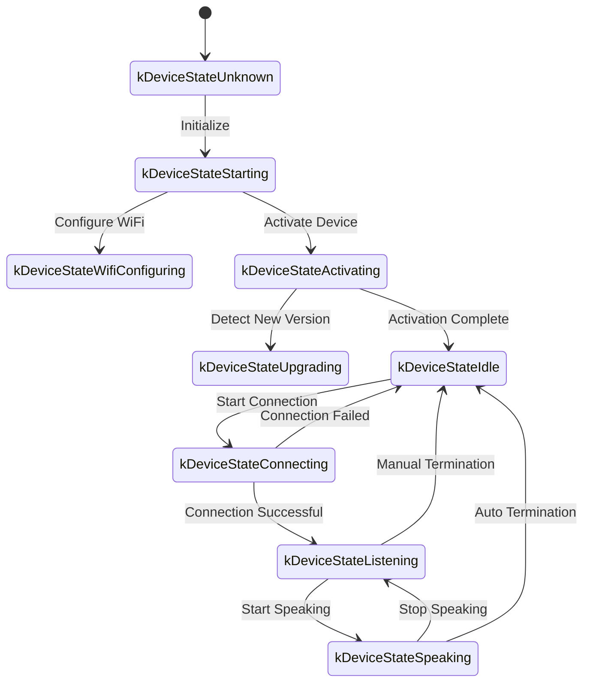
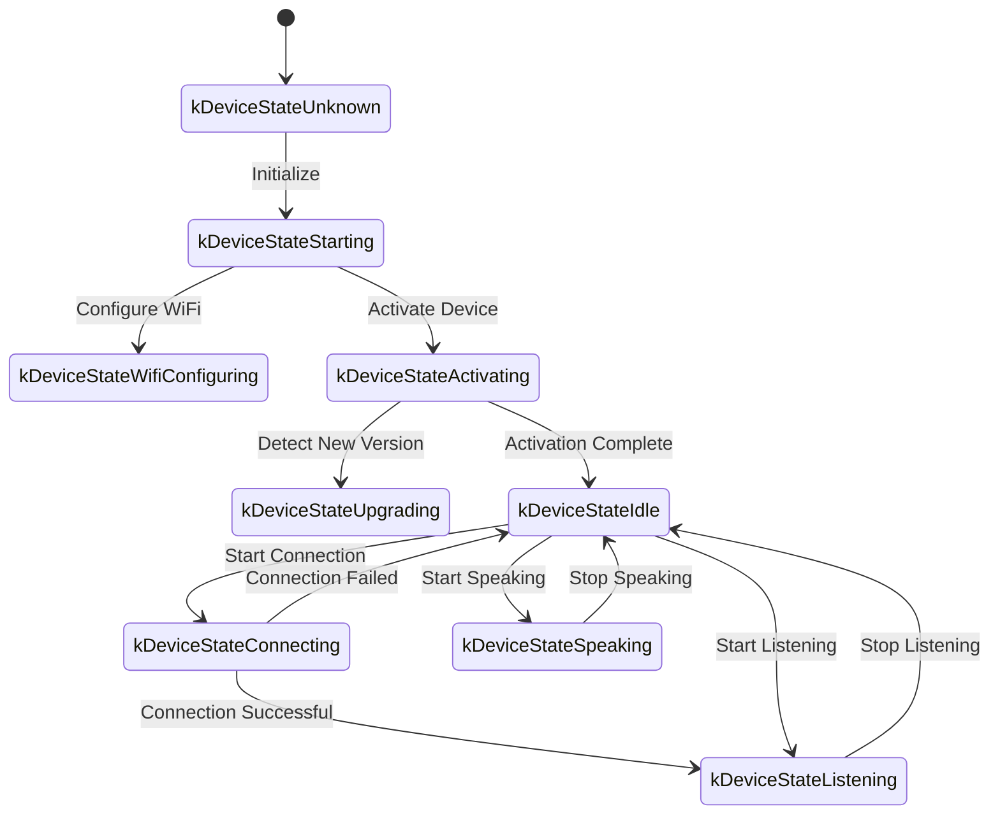

# WebSocket Communication Protocol Documentation

The following is a WebSocket communication protocol documentation organized based on code implementation, outlining how the device and server interact through WebSocket.

This documentation is based only on inferences from the provided code. Actual deployment may require further confirmation or supplementation in combination with server-side implementation.

---

## 1. Overall Process Overview

1. **Device Initialization**  
   - Device powers on, initializes `Application`:  
     - Initializes audio codec, display, LED, etc.  
     - Connects to network  
     - Creates and initializes a WebSocket protocol instance (`WebsocketProtocol`) implementing the `Protocol` interface  
   - Enters main loop waiting for events (audio input, audio output, scheduled tasks, etc.).

2. **Establish WebSocket Connection**  
   - When the device needs to start a voice session (e.g., user wake-up, manual key press, etc.), it calls `OpenAudioChannel()`:  
     - Gets WebSocket URL based on configuration
     - Sets several request headers (`Authorization`, `Protocol-Version`, `Device-Id`, `Client-Id`)  
     - Calls `Connect()` to establish WebSocket connection with server  

3. **Device Sends "hello" Message**  
   - After successful connection, the device sends a JSON message with the following example structure:  
   ```json
   {
     "type": "hello",
     "version": 1,
     "features": {
       "mcp": true
     },
     "transport": "websocket",
     "audio_params": {
       "format": "opus",
       "sample_rate": 16000,
       "channels": 1,
       "frame_duration": 60
     }
   }
   ```
   - The `features` field is optional, its content is auto-generated based on device compilation configuration. For example: `"mcp": true` indicates support for MCP protocol.
   - The value of `frame_duration` corresponds to `OPUS_FRAME_DURATION_MS` (e.g., 60ms).

4. **Server Replies "hello"**  
   - Device waits for the server to return a JSON message containing `"type": "hello"`, and checks if `"transport": "websocket"` matches.  
   - Server optionally sends down `session_id` field, device will auto-record it upon receipt.  
   - Example:
   ```json
   {
     "type": "hello",
     "transport": "websocket",
     "session_id": "xxx",
     "audio_params": {
       "format": "opus",
       "sample_rate": 24000,
       "channels": 1,
       "frame_duration": 60
     }
   }
   ```
   - If it matches, the server is considered ready and audio channel opening is marked as successful.  
   - If no correct reply is received within timeout (default 10 seconds), connection is considered failed and network error callback is triggered.

5. **Subsequent Message Exchange**  
   - Device and server can send two main types of data:  
     1. **Binary Audio Data** (Opus encoded)  
     2. **Text JSON Messages** (for transmitting chat status, TTS/STT events, MCP protocol messages, etc.)  

   - In the code, receive callbacks are mainly divided into:  
     - `OnData(...)`:  
       - When `binary` is `true`, it's recognized as audio frame; device will decode it as Opus data.  
       - When `binary` is `false`, it's recognized as JSON text, needs to be parsed on device side using cJSON and corresponding business logic handled (e.g., chat, TTS, MCP protocol messages, etc.).  

   - When server or network disconnects, callback `OnDisconnected()` is triggered:  
     - Device will call `on_audio_channel_closed_()`, and finally return to idle state.

6. **Close WebSocket Connection**  
   - When device needs to end a voice session, it calls `CloseAudioChannel()` to actively disconnect and return to idle state.  
   - Or if server actively disconnects, it will trigger the same callback flow.

---

## 2. Common Request Headers

When establishing WebSocket connection, the following request headers are set in code examples:

- `Authorization`: Used to store access token, format like `"Bearer <token>"`  
- `Protocol-Version`: Protocol version number, consistent with `version` field in hello message body  
- `Device-Id`: Device physical MAC address
- `Client-Id`: Software-generated UUID (will be reset if NVS is erased or firmware is reflashed)

These headers will be sent along with WebSocket handshake to the server, where server can validate and authenticate based on requirements.

---

## 3. Binary Protocol Versions

Device supports multiple binary protocol versions, specified through `version` field in configuration:

### 3.1 Version 1 (Default)
Send Opus audio data directly with no additional metadata. WebSocket protocol distinguishes between text and binary.

### 3.2 Version 2
Uses `BinaryProtocol2` structure:
```c
struct BinaryProtocol2 {
    uint16_t version;        // Protocol version
    uint16_t type;           // Message type (0: OPUS, 1: JSON)
    uint32_t reserved;       // Reserved field
    uint32_t timestamp;      // Timestamp (milliseconds, for server-side AEC)
    uint32_t payload_size;   // Payload size (bytes)
    uint8_t payload[];       // Payload data
} __attribute__((packed));
```

### 3.3 Version 3
Uses `BinaryProtocol3` structure:
```c
struct BinaryProtocol3 {
    uint8_t type;            // Message type
    uint8_t reserved;        // Reserved field
    uint16_t payload_size;   // Payload size
    uint8_t payload[];       // Payload data
} __attribute__((packed));
```

---

## 4. JSON Message Structure

WebSocket text frames are transmitted in JSON format. Below are common `"type"` fields and their corresponding business logic. If the message contains unlisted fields, they may be optional or implementation-specific details.

### 4.1 Device → Server

1. **Hello**  
   - Sent by device after successful connection, informing server of basic parameters.  
   - Example:
     ```json
     {
       "type": "hello",
       "version": 1,
       "features": {
         "mcp": true
       },
       "transport": "websocket",
       "audio_params": {
         "format": "opus",
         "sample_rate": 16000,
         "channels": 1,
         "frame_duration": 60
       }
     }
     ```

2. **Listen**  
   - Indicates device starting or stopping audio recording monitoring.  
   - Common fields:  
     - `"session_id"`: Session identifier  
     - `"type": "listen"`  
     - `"state"`: `"start"`, `"stop"`, `"detect"` (wake-up detection triggered)  
     - `"mode"`: `"auto"`, `"manual"` or `"realtime"`, indicating recognition mode.  
   - Example: Start listening  
     ```json
     {
       "session_id": "xxx",
       "type": "listen",
       "state": "start",
       "mode": "manual"
     }
     ```

3. **Abort**  
   - Terminates current speech (TTS playback) or voice channel.  
   - Example:
     ```json
     {
       "session_id": "xxx",
       "type": "abort",
       "reason": "wake_word_detected"
     }
     ```
   - `reason` value can be `"wake_word_detected"` or others.

4. **Wake Word Detected**  
   - Used for device to notify server of detected wake-up word.
   - Before sending this message, can send wake-up word Opus audio data in advance for server voice print detection.  
   - Example:
     ```json
     {
       "session_id": "xxx",
       "type": "listen",
       "state": "detect",
       "text": "Hello Xiaoming"
     }
     ```

5. **MCP**
   - Recommended new-generation protocol for IoT control. All device capability discovery, tool calls, etc. are done through messages with type: "mcp", with payload being standard JSON-RPC 2.0 (see [MCP Protocol Documentation](./mcp-protocol-en.md)).
   
   - **Example of device sending result to server:**
     ```json
     {
       "session_id": "xxx",
       "type": "mcp",
       "payload": {
         "jsonrpc": "2.0",
         "id": 1,
         "result": {
           "content": [
             { "type": "text", "text": "true" }
           ],
           "isError": false
         }
       }
     }
     ```

---

### 4.2 Server → Device

1. **Hello**  
   - Handshake confirmation message returned by server.  
   - Must contain `"type": "hello"` and `"transport": "websocket"`.  
   - May include `audio_params` indicating server's expected audio parameters or configuration aligned with device.   
   - Server optionally sends `session_id` field, device will auto-record it upon receipt.  
   - Upon successful receipt, device will set event flag indicating WebSocket channel is ready.

2. **STT**  
   - `{"session_id": "xxx", "type": "stt", "text": "..."}`
   - Indicates server recognized user speech (e.g., speech-to-text result)  
   - Device may display this text on screen, then proceed to response flow.

3. **LLM**  
   - `{"session_id": "xxx", "type": "llm", "emotion": "happy", "text": "😀"}`
   - Server instructs device to adjust facial animation / UI expression.  

4. **TTS**  
   - `{"session_id": "xxx", "type": "tts", "state": "start"}`: Server prepares to send TTS audio, device enters "speaking" playback state.  
   - `{"session_id": "xxx", "type": "tts", "state": "stop"}`: Indicates current TTS ends.  
   - `{"session_id": "xxx", "type": "tts", "state": "sentence_start", "text": "..."}`
     - Allows device to display current text fragment to be played or read on interface (e.g., for showing to user).  

5. **MCP**
   - Server sends IoT-related control commands or returns call results through type: "mcp" messages, payload structure same as above.
   
   - **Example of server sending tools/call to device:**
     ```json
     {
       "session_id": "xxx",
       "type": "mcp",
       "payload": {
         "jsonrpc": "2.0",
         "method": "tools/call",
         "params": {
           "name": "self.light.set_rgb",
           "arguments": { "r": 255, "g": 0, "b": 0 }
         },
         "id": 1
       }
     }
     ```

6. **System**
   - System control command, commonly used for remote upgrade and update.
   - Example:
     ```json
     {
       "session_id": "xxx",
       "type": "system",
       "command": "reboot"
     }
     ```
   - Supported commands:
     - `"reboot"`: Reboot device

7. **Custom** (Optional)
   - Custom message, supported when `CONFIG_RECEIVE_CUSTOM_MESSAGE` is enabled.
   - Example:
     ```json
     {
       "session_id": "xxx",
       "type": "custom",
       "payload": {
         "message": "custom content"
       }
     }
     ```

8. **Audio Data: Binary Frame**  
   - When server sends audio binary frame (Opus encoded), device decodes and plays it.  
   - If device is in "listening" (recording) state, received audio frames will be ignored or cleared to prevent conflicts.

---

## 5. Audio Encoding and Decoding

1. **Device Sends Recording Data**  
   - Audio input after possible echo cancellation, noise reduction or volume gain, is packed through Opus encoding into binary frame and sent to server.  
   - Depending on protocol version, may directly send Opus data (version 1) or use binary protocol with metadata (versions 2/3).

2. **Device Plays Received Audio**  
   - When receiving binary frame from server, it's likewise recognized as Opus data.  
   - Device will decode it, then pass to audio output interface for playback.  
   - If server's audio sample rate differs from device, resampling will occur after decoding.

---

## 6. Common State Transitions

Below are common key state transitions on device side, corresponding to WebSocket messages:

1. **Idle** → **Connecting**  
   - After user trigger or wake-up, device calls `OpenAudioChannel()` → establishes WebSocket connection → sends `"type":"hello"`.  

2. **Connecting** → **Listening**  
   - After successful connection, if `SendStartListening(...)` continues to execute, enters recording state. Device will continuously encode microphone data and send to server.  

3. **Listening** → **Speaking**  
   - Receives server TTS Start message (`{"type":"tts","state":"start"}`) → stops recording and plays received audio.  

4. **Speaking** → **Idle**  
   - Server TTS Stop (`{"type":"tts","state":"stop"}`) → audio playback ends. If not continuing to auto-listen, returns to Idle; if auto-loop configured, enters Listening again.  

5. **Listening** / **Speaking** → **Idle** (Exception or manual interruption)  
   - Calls `SendAbortSpeaking(...)` or `CloseAudioChannel()` → interrupts session → closes WebSocket → state returns to Idle.  

### Auto Mode State Transition Diagram



### Manual Mode State Transition Diagram



---

## 7. Error Handling

1. **Connection Failure**  
   - If `Connect(url)` returns failure or times out while waiting for server "hello" message, triggers `on_network_error_()` callback. Device displays "Unable to connect to service" or similar error message.

2. **Server Disconnection**  
   - If WebSocket abnormally disconnects, callback `OnDisconnected()` is triggered:  
     - Device calls `on_audio_channel_closed_()`  
     - Switches to Idle or other retry logic.

---

## 8. Other Considerations

1. **Authentication**  
   - Device provides authentication by setting `Authorization: Bearer <token>`, server-side needs to verify validity.  
   - If token expires or is invalid, server can refuse handshake or disconnect subsequently.

2. **Session Control**  
   - Some messages in code include `session_id`, used to distinguish independent conversations or operations. Server can handle different sessions separately as needed.

3. **Audio Payload**  
   - Code defaults to Opus format with `sample_rate = 16000`, mono. Frame duration is controlled by `OPUS_FRAME_DURATION_MS`, typically 60ms. Can be adjusted appropriately based on bandwidth or performance. For better music playback quality, server downlink audio may use 24000 sample rate.

4. **Protocol Version Configuration**  
   - Configure binary protocol version (1, 2, or 3) through `version` field in settings
   - Version 1: Send Opus data directly
   - Version 2: Use binary protocol with timestamp, suitable for server-side AEC
   - Version 3: Use simplified binary protocol

5. **MCP Protocol Recommended for IoT Control**  
   - Device-server IoT capability discovery, status sync, control commands, etc. should all be implemented through MCP protocol (type: "mcp"). Previous type: "iot" scheme is deprecated.
   - MCP protocol can be transmitted over various underlying protocols like WebSocket, MQTT, providing better extensibility and standardization.
   - For detailed usage, refer to [MCP Protocol Documentation](./mcp-protocol-en.md) and [MCP IoT Control Usage](./mcp-usage-en.md).

6. **Error or Invalid JSON**  
   - When JSON lacks required fields, e.g., `{"type": ...}`, device will log error (`ESP_LOGE(TAG, "Missing message type, data: %s", data);`), will not execute any business logic.

---

## 9. Message Examples

Below is a typical bidirectional message example (simplified process):

1. **Device → Server** (Handshake)
   ```json
   {
     "type": "hello",
     "version": 1,
     "features": {
       "mcp": true
     },
     "transport": "websocket",
     "audio_params": {
       "format": "opus",
       "sample_rate": 16000,
       "channels": 1,
       "frame_duration": 60
     }
   }
   ```

2. **Server → Device** (Handshake Response)
   ```json
   {
     "type": "hello",
     "transport": "websocket",
     "session_id": "xxx",
     "audio_params": {
       "format": "opus",
       "sample_rate": 16000
     }
   }
   ```

3. **Device → Server** (Start Listening)
   ```json
   {
     "session_id": "xxx",
     "type": "listen",
     "state": "start",
     "mode": "auto"
   }
   ```
   At the same time device starts sending binary frames (Opus data).

4. **Server → Device** (ASR Result)
   ```json
   {
     "session_id": "xxx",
     "type": "stt",
     "text": "what user said"
   }
   ```

5. **Server → Device** (TTS Start)
   ```json
   {
     "session_id": "xxx",
     "type": "tts",
     "state": "start"
   }
   ```
   Then server sends binary audio frames to device for playback.

6. **Server → Device** (TTS End)
   ```json
   {
     "session_id": "xxx",
     "type": "tts",
     "state": "stop"
   }
   ```
   Device stops audio playback, if no more commands, returns to idle state.

---

## 10. Summary

This protocol transmits JSON text and binary audio frames over WebSocket layer, implementing functions including audio stream upload, TTS audio playback, speech recognition and status management, MCP command delivery, etc. Its core features:

- **Handshake Phase**: Send `"type":"hello"`, wait for server response.  
- **Audio Channel**: Use binary frames with Opus encoding for bidirectional speech stream transmission, supporting multiple protocol versions.  
- **JSON Messages**: Use `"type"` as core field to identify different business logic, including TTS, STT, MCP, WakeWord, System, Custom, etc.  
- **Extensibility**: Can add fields in JSON messages as needed, or perform additional authentication in headers.

Server and device must pre-agree on field meanings, timing logic and error handling rules for various messages to ensure smooth communication. Above information can serve as foundation documentation for subsequent integration, development or extension.
