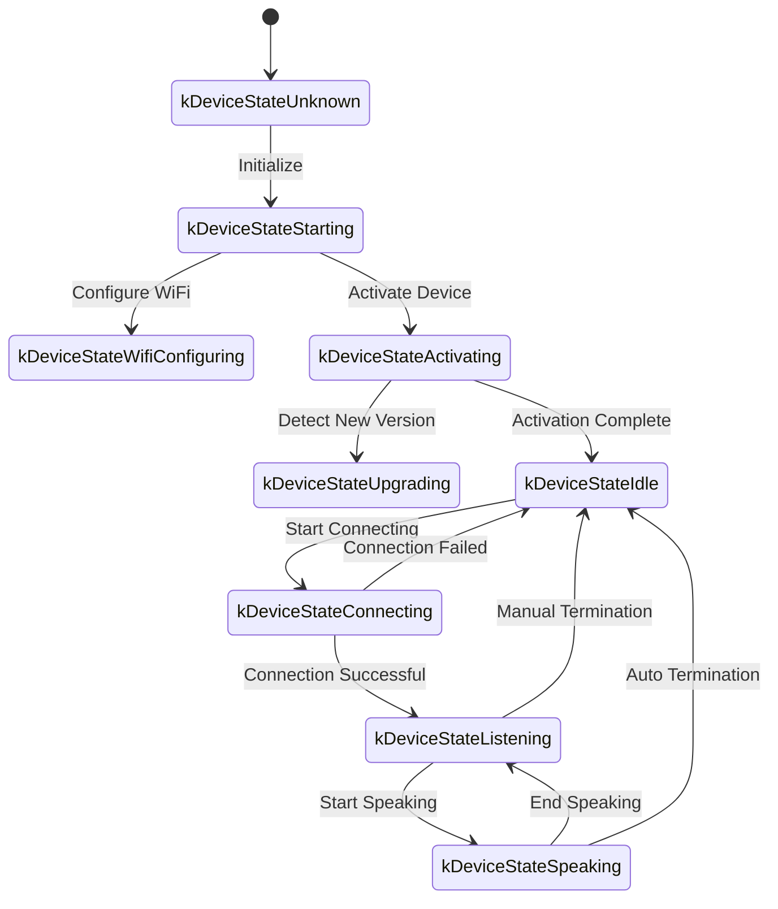
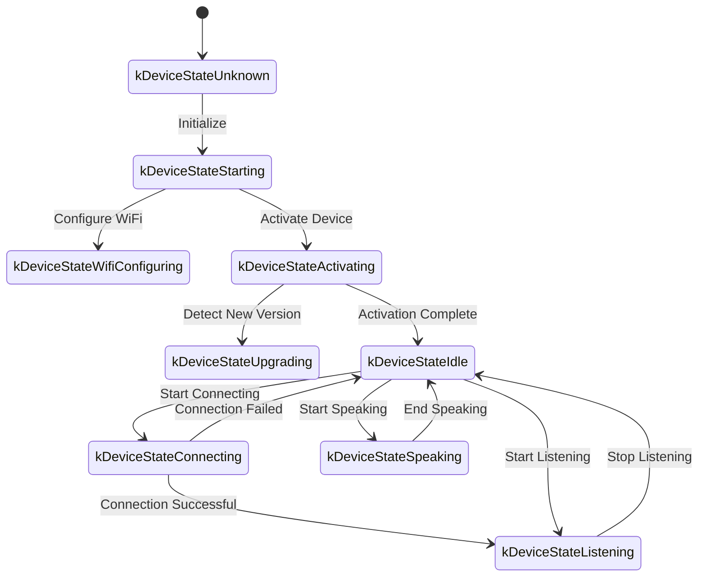

The following is a WebSocket communication protocol document organized based on code implementation, outlining how devices and servers interact through WebSocket.

This document is based solely on inference from the provided code, and may require further confirmation or supplementation in conjunction with server-side implementation during actual deployment.

---

## 1. Overall Flow Overview

1. **Device Initialization**  
   - Device power-on, initialize `Application`:  
     - Initialize audio codecs, display, LED, etc.  
     - Connect to network  
     - Create and initialize WebSocket protocol instance implementing `Protocol` interface (`WebsocketProtocol`)  
   - Enter main loop waiting for events (audio input, audio output, scheduled tasks, etc.).

2. **Establish WebSocket Connection**  
   - When the device needs to start a voice session (e.g., user wake-up, manual button trigger, etc.), call `OpenAudioChannel()`:  
     - Get WebSocket URL from configuration
     - Set several request headers (`Authorization`, `Protocol-Version`, `Device-Id`, `Client-Id`)  
     - Call `Connect()` to establish WebSocket connection with server  

3. **Device Sends "hello" Message**  
   - After successful connection, the device will send a JSON message with the following example structure:  
   ```json
   {
     "type": "hello",
     "version": 1,
     "features": {
       "mcp": true
     },
     "transport": "websocket",
     "audio_params": {
       "format": "opus",
       "sample_rate": 16000,
       "channels": 1,
       "frame_duration": 60
     }
   }
   ```
   - The `features` field is optional, with content automatically generated based on device compilation configuration. For example: `"mcp": true` indicates MCP protocol support.
   - The `frame_duration` value corresponds to `OPUS_FRAME_DURATION_MS` (e.g., 60ms).

4. **Server Replies "hello"**  
   - The device waits for the server to return a JSON message containing `"type": "hello"` and checks if `"transport": "websocket"` matches.  
   - The server can optionally send a `session_id` field, which the device will automatically record upon receipt.  
   - Example:
   ```json
   {
     "type": "hello",
     "transport": "websocket",
     "session_id": "xxx",
     "audio_params": {
       "format": "opus",
       "sample_rate": 24000,
       "channels": 1,
       "frame_duration": 60
     }
   }
   ```
   - If matched, the server is considered ready and the audio channel opening is marked as successful.  
   - If no correct reply is received within the timeout period (default 10 seconds), the connection is considered failed and a network error callback is triggered.

5. **Subsequent Message Interaction**  
   - Two main types of data can be sent between device and server:  
     1. **Binary audio data** (Opus encoded)  
     2. **Text JSON messages** (for transmitting chat status, TTS/STT events, MCP protocol messages, etc.)  

   - In the code, receive callbacks are mainly divided into:  
     - `OnData(...)`:  
       - When `binary` is `true`, it is considered an audio frame; the device will decode it as Opus data.  
       - When `binary` is `false`, it is considered JSON text that needs to be parsed with cJSON on the device and processed with corresponding business logic (such as chat, TTS, MCP protocol messages, etc.).  

   - When the server or network disconnects, the `OnDisconnected()` callback is triggered:  
     - The device will call `on_audio_channel_closed_()` and eventually return to idle state.

6. **Close WebSocket Connection**  
   - When the device needs to end the voice session, it will call `CloseAudioChannel()` to actively disconnect and return to idle state.  
   - Or if the server actively disconnects, it will also trigger the same callback flow.

---

## 2. Common Request Headers

When establishing a WebSocket connection, the following request headers are set in the code example:

- `Authorization`: Used to store access tokens, in the form of `"Bearer <token>"`  
- `Protocol-Version`: Protocol version number, consistent with the `version` field in the hello message body  
- `Device-Id`: Device physical network card MAC address
- `Client-Id`: Software-generated UUID (will be reset when erasing NVS or re-flashing complete firmware)

These headers are sent to the server along with the WebSocket handshake, and the server can perform validation, authentication, etc. as needed.

---

## 3. Binary Protocol Versions

The device supports multiple binary protocol versions, specified through the `version` field in configuration:

### 3.1 Version 1 (Default)
Directly sends Opus audio data without additional metadata. WebSocket protocol distinguishes between text and binary.

### 3.2 Version 2
Uses `BinaryProtocol2` structure:
```c
struct BinaryProtocol2 {
    uint16_t version;        // Protocol version
    uint16_t type;           // Message type (0: OPUS, 1: JSON)
    uint32_t reserved;       // Reserved field
    uint32_t timestamp;      // Timestamp (milliseconds, for server-side AEC)
    uint32_t payload_size;   // Payload size (bytes)
    uint8_t payload[];       // Payload data
} __attribute__((packed));
```

### 3.3 Version 3
Uses `BinaryProtocol3` structure:
```c
struct BinaryProtocol3 {
    uint8_t type;            // Message type
    uint8_t reserved;        // Reserved field
    uint16_t payload_size;   // Payload size
    uint8_t payload[];       // Payload data
} __attribute__((packed));
```

---

## 4. JSON Message Structure

WebSocket text frames are transmitted in JSON format. The following are common `"type"` fields and their corresponding business logic. If messages contain unlisted fields, they may be optional or implementation-specific details.

### 4.1 Device → Server

1. **Hello**  
   - Sent by the device after successful connection to inform the server of basic parameters.  
   - Example:
     ```json
     {
       "type": "hello",
       "version": 1,
       "features": {
         "mcp": true
       },
       "transport": "websocket",
       "audio_params": {
         "format": "opus",
         "sample_rate": 16000,
         "channels": 1,
         "frame_duration": 60
       }
     }
     ```

2. **Listen**  
   - Indicates the device starts or stops recording/listening.  
   - Common fields:  
     - `"session_id"`: Session identifier  
     - `"type": "listen"`  
     - `"state"`: `"start"`, `"stop"`, `"detect"` (wake detection triggered)  
     - `"mode"`: `"auto"`, `"manual"` or `"realtime"`, indicating recognition mode.  
   - Example: Start listening  
     ```json
     {
       "session_id": "xxx",
       "type": "listen",
       "state": "start",
       "mode": "manual"
     }
     ```

3. **Abort**  
   - Terminate current speaking (TTS playback) or voice channel.  
   - Example:
     ```json
     {
       "session_id": "xxx",
       "type": "abort",
       "reason": "wake_word_detected"
     }
     ```
   - `reason` value can be `"wake_word_detected"` or others.

4. **Wake Word Detected**  
   - Used for the device to inform the server that a wake word has been detected.
   - Before sending this message, wake word Opus audio data can be sent in advance for server voiceprint detection.  
   - Example:
     ```json
     {
       "session_id": "xxx",
       "type": "listen",
       "state": "detect",
       "text": "你好小明"
     }
     ```

5. **MCP**
   - New generation protocol recommended for IoT control. All device capability discovery, tool calls, etc. are conducted through type: "mcp" messages, with payload internally being standard JSON-RPC 2.0 (see [MCP Protocol Documentation](./mcp-protocol.md) for details).
   
   - **Example of device sending result to server:**
     ```json
     {
       "session_id": "xxx",
       "type": "mcp",
       "payload": {
         "jsonrpc": "2.0",
         "id": 1,
         "result": {
           "content": [
             { "type": "text", "text": "true" }
           ],
           "isError": false
         }
       }
     }
     ```

---

### 4.2 Server → Device

1. **Hello**  
   - Handshake confirmation message returned by the server.  
   - Must include `"type": "hello"` and `"transport": "websocket"`.  
   - May include `audio_params`, indicating server-expected audio parameters or configuration aligned with device.   
   - Server can optionally send `session_id` field, which the device will automatically record upon receipt.  
   - After successful reception, device will set event flag indicating WebSocket channel is ready.

2. **STT**  
   - `{"session_id": "xxx", "type": "stt", "text": "..."}`
   - Indicates the server has recognized user speech (e.g., speech-to-text result).  
   - The device may display this text on screen, then proceed to response flow, etc.

3. **LLM**  
   - `{"session_id": "xxx", "type": "llm", "emotion": "happy", "text": "😀"}`
   - Server instructs device to adjust emotional animation/UI expression.  

4. **TTS**  
   - `{"session_id": "xxx", "type": "tts", "state": "start"}`: Server prepares to send TTS audio, device enters "speaking" playback state.  
   - `{"session_id": "xxx", "type": "tts", "state": "stop"}`: Indicates this TTS session has ended.  
   - `{"session_id": "xxx", "type": "tts", "state": "sentence_start", "text": "..."}`
     - Makes device display current text segment to be played or read on the interface (e.g., for user display).  

5. **MCP**
   - Server sends IoT-related control commands or returns call results through type: "mcp" messages, payload structure same as above.
   
   - **Example of server sending tools/call to device:**
     ```json
     {
       "session_id": "xxx",
       "type": "mcp",
       "payload": {
         "jsonrpc": "2.0",
         "method": "tools/call",
         "params": {
           "name": "self.light.set_rgb",
           "arguments": { "r": 255, "g": 0, "b": 0 }
         },
         "id": 1
       }
     }
     ```

6. **System**
   - System control commands, commonly used for remote upgrade updates.
   - Example:
     ```json
     {
       "session_id": "xxx",
       "type": "system",
       "command": "reboot"
     }
     ```
   - Supported commands:
     - `"reboot"`: Restart device

7. **Custom** (Optional)
   - Custom messages, supported when `CONFIG_RECEIVE_CUSTOM_MESSAGE` is enabled.
   - Example:
     ```json
     {
       "session_id": "xxx",
       "type": "custom",
       "payload": {
         "message": "Custom content"
       }
     }
     ```

8. **Audio Data: Binary Frames**  
   - When the server sends audio binary frames (Opus encoded), the device decodes and plays them.  
   - If the device is in "listening" (recording) state, received audio frames will be ignored or cleared to prevent conflicts.

---

## 5. Audio Codec

1. **Device Sends Recording Data**  
   - Audio input goes through possible echo cancellation, noise reduction, or volume gain, then is Opus-encoded and packaged into binary frames sent to the server.  
   - Depending on protocol version, may directly send Opus data (version 1) or use binary protocol with metadata (version 2/3).

2. **Device Plays Received Audio**  
   - When receiving binary frames from the server, they are also identified as Opus data.  
   - The device will decode them and then pass them to the audio output interface for playback.  
   - If the server's audio sample rate differs from the device, resampling will be performed after decoding.

---

## 6. Common State Transitions

The following are common key state transitions on the device side, corresponding to WebSocket messages:

1. **Idle** → **Connecting**  
   - After user trigger or wake-up, device calls `OpenAudioChannel()` → establishes WebSocket connection → sends `"type":"hello"`.  

2. **Connecting** → **Listening**  
   - After successful connection establishment, if `SendStartListening(...)` continues to execute, enters recording state. At this time, device will continuously encode microphone data and send to server.  

3. **Listening** → **Speaking**  
   - Receives server TTS Start message (`{"type":"tts","state":"start"}`) → stops recording and plays received audio.  

4. **Speaking** → **Idle**  
   - Server TTS Stop (`{"type":"tts","state":"stop"}`) → audio playback ends. If not continuing to auto-listen, returns to Idle; if auto-loop is configured, re-enters Listening.  

5. **Listening** / **Speaking** → **Idle** (encountering exceptions or active interruption)  
   - Calls `SendAbortSpeaking(...)` or `CloseAudioChannel()` → interrupts session → closes WebSocket → state returns to Idle.  

### Auto Mode State Transition Diagram



### Manual Mode State Transition Diagram



---

## 7. Error Handling

1. **Connection Failure**  
   - If `Connect(url)` returns failure or times out while waiting for server "hello" message, triggers `on_network_error_()` callback. Device will show "Unable to connect to service" or similar error message.

2. **Server Disconnection**  
   - If WebSocket disconnects abnormally, callback `OnDisconnected()`:  
     - Device callbacks `on_audio_channel_closed_()`  
     - Switches to Idle or other retry logic.

---

## 8. Other Considerations

1. **Authentication**  
   - Device provides authentication by setting `Authorization: Bearer <token>`, server needs to verify validity.  
   - If token is expired or invalid, server can reject handshake or disconnect subsequently.

2. **Session Control**  
   - Some messages in the code contain `session_id`, used to distinguish independent conversations or operations. Server can handle different sessions separately as needed.

3. **Audio Payload**  
   - Code defaults to using Opus format, with `sample_rate = 16000`, mono. Frame duration is controlled by `OPUS_FRAME_DURATION_MS`, typically 60ms. Can be adjusted appropriately based on bandwidth or performance. For better music playback effects, server downlink audio may use 24000 sample rate.

4. **Protocol Version Configuration**  
   - Configure binary protocol version (1, 2, or 3) through `version` field in settings
   - Version 1: Direct Opus data transmission
   - Version 2: Binary protocol with timestamp, suitable for server-side AEC
   - Version 3: Simplified binary protocol

5. **IoT Control Recommends MCP Protocol**  
   - IoT capability discovery, status synchronization, control commands, etc. between device and server are recommended to be implemented entirely through MCP protocol (type: "mcp"). The original type: "iot" approach has been deprecated.
   - MCP protocol can be transmitted over various underlying protocols such as WebSocket, MQTT, etc., providing better scalability and standardization capabilities.
   - For detailed usage, please refer to [MCP Protocol Documentation](./mcp-protocol.md) and [MCP IoT Control Usage](./mcp-usage.md).

6. **Erroneous or Exception JSON**  
   - When JSON lacks necessary fields, e.g., `{"type": ...}`, the device will log error messages (`ESP_LOGE(TAG, "Missing message type, data: %s", data);`) and will not execute any business logic.

---

## 9. Message Examples

Below is a typical bidirectional message example (simplified flow demonstration):

1. **Device → Server** (Handshake)
   ```json
   {
     "type": "hello",
     "version": 1,
     "features": {
       "mcp": true
     },
     "transport": "websocket",
     "audio_params": {
       "format": "opus",
       "sample_rate": 16000,
       "channels": 1,
       "frame_duration": 60
     }
   }
   ```

2. **Server → Device** (Handshake Response)
   ```json
   {
     "type": "hello",
     "transport": "websocket",
     "session_id": "xxx",
     "audio_params": {
       "format": "opus",
       "sample_rate": 16000
     }
   }
   ```

3. **Device → Server** (Start Listening)
   ```json
   {
     "session_id": "xxx",
     "type": "listen",
     "state": "start",
     "mode": "auto"
   }
   ```
   At the same time, the device starts sending binary frames (Opus data).

4. **Server → Device** (ASR Result)
   ```json
   {
     "session_id": "xxx",
     "type": "stt",
     "text": "What the user said"
   }
   ```

5. **Server → Device** (TTS Start)
   ```json
   {
     "session_id": "xxx",
     "type": "tts",
     "state": "start"
   }
   ```
   Then the server sends binary audio frames to the device for playback.

6. **Server → Device** (TTS End)
   ```json
   {
     "session_id": "xxx",
     "type": "tts",
     "state": "stop"
   }
   ```
   The device stops playing audio and returns to idle state if there are no more commands.

---

## 10. Summary

This protocol accomplishes functions including audio stream upload, TTS audio playback, speech recognition and state management, MCP command delivery, etc., through transmitting JSON text and binary audio frames over WebSocket. Its core characteristics:

- **Handshake Phase**: Send `"type":"hello"`, wait for server return.  
- **Audio Channel**: Bidirectional transmission of voice streams using Opus-encoded binary frames, supporting multiple protocol versions.  
- **JSON Messages**: Use `"type"` as core field to identify different business logic, including TTS, STT, MCP, WakeWord, System, Custom, etc.  
- **Extensibility**: Can add fields to JSON messages or perform additional authentication in headers according to actual needs.

Server and device need to agree in advance on field meanings of various messages, timing logic, and error handling rules to ensure smooth communication. The above information can serve as foundational documentation for subsequent integration, development, or extension.
